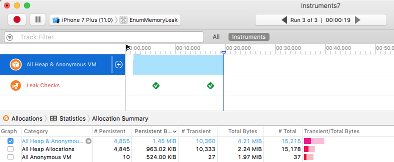

# Optinal Enum (with @objc) + Mutable Array Leak (Swift 3) 

## How to replicate the leak
When an enum marked with @objc and this enum is an optional class property + the same class has an mutable (var) array with elements in it, there is an unexpected memory leak. 

```swift
// Without @objc this enum won't leak
// however when this enum is included in a class
// which contains an array, it will leak.
@objc enum leakingObjCMarkedEnum: Int {
    
    // just some random cases
    case memoryLeakCase, memoryLeakCaseTwo
}

// Wrapper class which contains and Enum & Array
// We need the Array to make sure Enums leak
class WrapperClass {
    
    // Optional Enums leak (which are marked with @objc)
    var leakOptionalEnum: leakingObjCMarkedEnum?
    
    // Create an array to prove our case
    // Empty arrays won't cause the leak, so lets add a random Int
    var myArray: [Int] = [80]

}

class ViewController: UIViewController {
    
    // Optinal Wrapper Class property
    var wc: WrapperClass?
    
    override func viewDidLoad() {
        super.viewDidLoad()
        
        // init an object from our leaking class
        // and things will start leaking at this point
        wc = WrapperClass()
    }
    
}
```

#### Command + I -> Leaks Instrument -> Record


## How to prevent the leak

Moment we convert ```leakOptionalEnum``` optional var to a non-optional var leak will disappear. 

```swift
    // Lets convert the optional property to a non-optional
    var leakOptionalEnum: leakingObjCMarkedEnum = .memoryLeakCase
```

#### Command + I -> Leaks Instrument -> Record




## Similar reported leaks
We found a stackoverflow question which addresses the root cause of this issue without the @objc marker. (https://stackoverflow.com/questions/42602301/swift-3-enums-leak-memory-when-the-class-contains-an-array ) This particular case seems to be fixed in later versions of XC and Swift.

```swift
enum LeakingEnum: Int, RawRepresentable {
    case
    LeakCase,
    AnotherLeakCase
}

class Primitive {
    var lightingType: LeakingEnum?
    var mysub : [Int] = []
    init() {
        mysub.append(80)
    }
}

class ViewController: UIViewController {
    var prim: Primitive?
    override func viewDidLoad() {
        super.viewDidLoad()
        prim = Primitive()
    }
}
```

## Conclusion
We believe this is a compiler related issue and opening a Radar to Apple.


